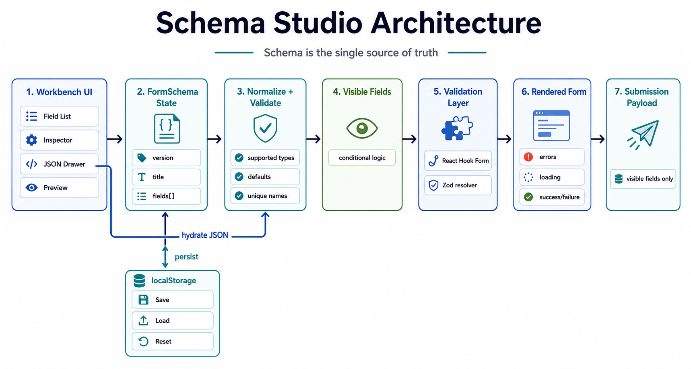
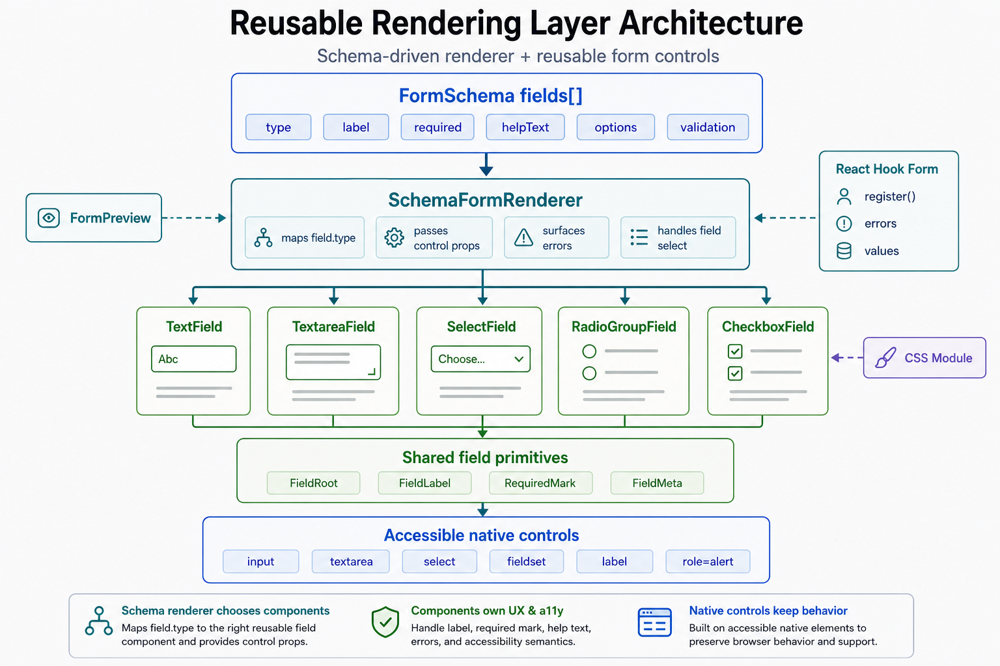

# Schema Studio

Schema Studio is a React app for visually designing forms, exporting the current form as JSON, hydrating the builder from JSON, and rendering a live validated preview with mock submission states. It also separates the schema-rendering layer from the builder so the same renderer and form controls could be reused in other product surfaces.

The core idea is that a form should be configurable as data. A user can shape the form in the builder, inspect or edit the schema directly, and see the same schema drive a reusable rendering layer.

## Local Setup

```bash
npm install
npm run dev
```

The app runs at the Vite URL shown in the terminal, typically `http://localhost:5173/schema-studio/`.

Useful checks:

```bash
npm run test
npm run build
```

Browser smoke test:

```bash
npx playwright install chromium
npm run test:e2e
```

## Schema Studio Architecture



The app keeps a single `FormSchema` as the source of truth. Builder actions update that schema, the JSON drawer serializes the same object, and importing JSON validates and normalizes it before replacing app state.

At render time, the preview watches current form values, filters the schema down to visible fields, builds a dynamic Zod schema for those visible fields, and submits only the visible-field payload. That keeps conditional visibility, validation, and submission behavior aligned.

Key modules:

- `src/schema/types.ts` defines the public schema boundary.
- `src/schema/utils.ts` validates imports, normalizes defaults, creates fields, and enforces unique field names.
- `src/schema/validation.ts` converts schema fields into runtime validation and submission behavior.
- `src/components/FormPreview.tsx` connects the schema renderer to React Hook Form and the mock submission flow.
- `src/components/schema-renderer/SchemaFormRenderer.tsx` renders schema fields through reusable form controls.

## Reusable Rendering Layer Architecture



The reusable rendering layer lives in `src/components/schema-renderer`. `SchemaFormRenderer` separates schema interpretation from form control rendering by choosing the right control for each schema field, while the reusable controls own label, help text, error, required, and native accessibility behavior.

## Schema Model & Capabilities

The exported JSON is an app-specific schema, not formal JSON Schema. That keeps builder metadata, UI ordering, validation, defaults, options, and conditional visibility in one hydrated shape.

The public schema boundary is defined in `src/schema/types.ts`:

```ts
type FormSchema = {
  version: string;
  title: string;
  description?: string;
  fields: FieldSchema[];
};
```

Supported field types:

- `text`
- `textarea`
- `number`
- `select`
- `radio`
- `checkbox`
- `date`

Supported behavior:

- Editable labels, names, placeholders, help text, types, required flags, defaults, and options.
- Validation for required fields, min/max, regex, and named custom rules.
- Conditional visibility with one condition per field using `equals`, `notEquals`, or `exists`.
- Safe custom rules through a registry: `businessEmail`, `startsWith`, and `mustBeTrue`.
- Explicit localStorage persistence through Save, Load, and Reset.
- Mock submission with latency plus success and error states, without requiring a backend.

## Tech Stack

- Vite, React, and TypeScript
- React Hook Form and Zod for dynamic form state and validation
- dnd-kit for sortable builder fields
- Plain CSS for the workbench UI
- Vitest and Playwright for focused verification
